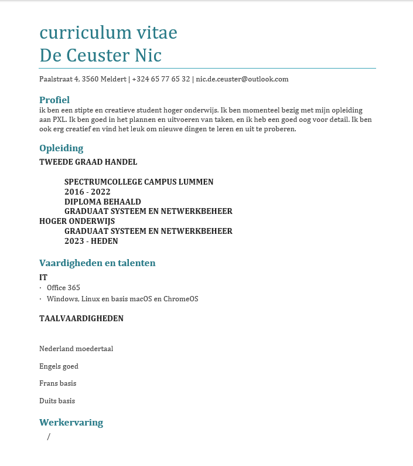

# Inleiding
Ik ben Nic Ik studeer de graduaat systeem en netwerkbeheer
In deze portfolio zal ik mijn leerervaringen en -resultaten tijdens werkplekleren 1 documenteren. Ik zal hierbij gebruik maken van reflecties. Een reflectie is een manier om je leerproces te evalueren. Je reflecteert op je ervaringen, je leert ervan en je stelt je doelen voor de toekomst.werkplekleren)
# persoonlijke info

naam: nic de ceuster

email : nic.de.ceuster@outlook.com schoolemail: 12200275@student.pxl.be

leeftijd: 19

telefoonnummer: +32465776532

diploma:
    6de middelbaar handel (tso)
behaalde certificaten:
    tot nu toe niks maar hier wil ik verandering inbrengen

werk ervaring:
    /

hobbies:
    - chiro
    - gaming

