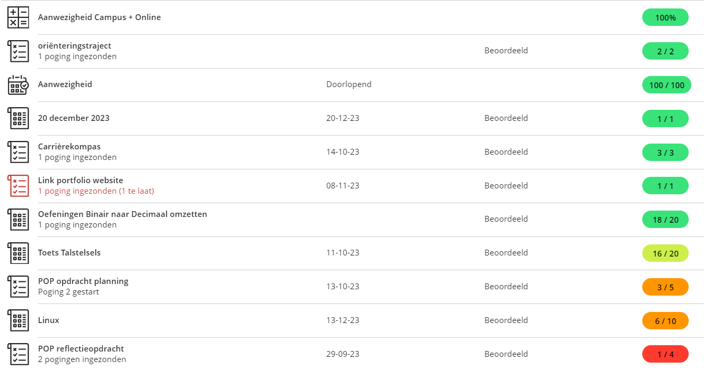

# Opdrachten

## Opdrachten WPL 1

### 1 reflectie opdracht
opdracht= schrijf een reflectie over een schoolervaring in de starr en kolb methode

### 2 planning opdracht
opdracht= maak een weekplanning.

### 3 carrierekompas
opdracht= maak een carrierekompas binnen de 24 uur.

### 4 oracle linux
opdracht= instaleeer nieuwe vm (oracle linux) met gnome als desktop enviroment doe alle taken rondt deze vm.

### 5 actualiteit
opdracht= research het onderwerp ai en discusier met een groep en tenslotte steek de overeenkomst in een document

### 6 netwerken
opdracht= bereid een config file voor om een switch en router gemakelijk in te stellen.
### 7 powerapps
opdracht= maak een app waarin je kan zoeken naar OLR's kan zoeken met trefwoorden.

### Reflectie en Resultaten
ik ben nooit goed geweest in reflecties dit valt mischien op in mijn resultaten. maar zolang ik mijn volle 100% geef haal ik meestal een niet zo slecht resultaat hierop.
aan mijn resultaten valt vooral op dat ik moeite heb met grote stukken theorie en zelfreflectie.

## Opdrachten WPL 2

### sprint 1 (solo)
in deze sprint leerden we kennis maken met AWS en gebruikten we het om een web server te hosten eerst in nginx en vervolgens in apache (we gebruikte ubuntu als operating system).

### sprint 2 - 5 (groep)
in deze opdracht moesten we een schoolomgeving simuleren. hiervoor gebruikten we vshpere. we werkte in de scrum methode met elke les een daily standup en elke 2 - 3 weken het einde van de sprint.

[hier wat extra info over een paar opdrachtjes](https://drive.google.com/file/d/1LxY5rdfLaoByXsMSrHCjfFkVlByaL1JB/view?usp=sharing)

## Opdrachten WPL 3
 
 
### Pitch
 
<iframe src="../images/WPL3-Pitch_NicDeCeuster.pdf" width="100%" height="800px" style="border:none;"></iframe>

 
### Opdracht Probleemsituatie en advies
 
<iframe src="../images/WPL3-Probleemsituatie_NicDeCeuster.pdf" width="100%" height="800px" style="border:none;"></iframe>

 
### Opdracht Werkkwaliteiten
 
<iframe src="../images/WPL3-Werkkwaliteiten_NicDeCeuster.pdf" width="100%" height="800px" style="border:none;"></iframe>

## Opdrachten WPL 4