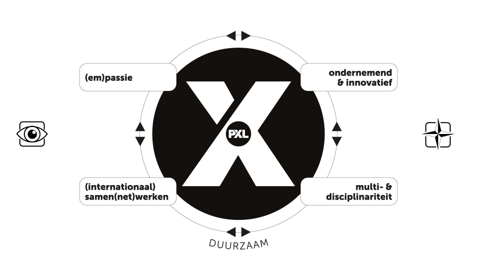

# Reflectie

## Reflectie WPL 1

### (em)passie

#### Wat is mijn passie? Hoe houdt dit verband met de opleiding?

Mijn passie is om mensen te helpen. Ik vind het leuk om problemen op te lossen en mensen te laten groeien. Ik geloof dat technologie een krachtige tool kan zijn om de wereld te verbeteren. Daarom heb ik gekozen voor de opleiding informatica.

#### Wat geeft mij energie en goesting? En hoe zie je dit in je opleiding terugkomen?

Wat mij energie en goesting geeft, is het gevoel dat ik iets zinvols doe. Ik vind het leuk om nieuwe dingen te leren en om uitdagingen aan te gaan. Ik ben ook een creatieve persoon en ik vind het leuk om nieuwe ideeën te bedenken.

#### Hoe zie je jezelf in dialoog gaan met anderen in de opleiding die je bent aangevat?

Ik denk dat het belangrijk is om in dialoog te gaan met anderen in de opleiding. Dit helpt me om te leren van anderen en om mijn eigen kennis en ervaring te delen. Ik ben een open persoon en ik vind het leuk om met anderen te praten over mijn interesses.

### Ondernemend & Innovatief

#### Wat versta jij onder een ken-doementaliteit (ondernemend zijn in de brede zin van het woord) en hoe zie je dat in de opleiding die je bent aangevat?

Wat versta jij onder een ken-doementaliteit (ondernemend zijn in de brede zin van het woord) en hoe zie je dat in de opleiding die je bent aangevat?
Ik versta onder een ken-doementaliteit dat je bereid bent om dingen te leren en om ze uit te proberen. Je bent niet bang om fouten te maken en je bent altijd op zoek naar nieuwe mogelijkheden.

#### Hoe ver sta jij op dit moment al in een ken-doementaliteit?

Ik denk dat ik op dit moment al een goede basis heb voor een ken-doementaliteit. Ik ben een nieuwsgierig persoon en ik vind het leuk om nieuwe dingen te leren. Ik ben ook niet bang om fouten te maken en ik leer ervan. Ik zie nog wel kansen voor verbetering. Ik wil bijvoorbeeld nog meer leren om mijn ideeën om te zetten in actie. Ik wil ook nog beter leren om samen te werken met anderen om mijn ideeën te realiseren.

### (Internationaal) Samen(net)werken

#### Hoe ziet jouw netwerk er op dit moment uit? Kan je dit netwerk inzetten in functie van de opleiding die je hebt aangevat?

Mijn netwerk bestaat op dit moment uit vrienden, familie, klasgenoten en collega's. Ik denk dat ik dit netwerk kan inzetten in functie van mijn opleiding op verschillende manieren. Ten eerste kan ik mijn netwerk gebruiken om informatie en ondersteuning te vinden. Ik kan bijvoorbeeld mijn vrienden of familie vragen om hulp bij een opdracht of project. Ten tweede kan ik mijn netwerk gebruiken om nieuwe kansen te ontdekken. Ik kan bijvoorbeeld via mijn connecties in contact komen met bedrijven of organisaties die op zoek zijn naar studenten.

#### Hoe zou jij internationaal samen kunnen werken in de opleiding die je hebt aangevat?

Ik zou internationaal samen kunnen werken in de opleiding door contact te leggen met studenten of professionals uit andere landen. Dit kan bijvoorbeeld via online forums of sociale media. Ik denk dat internationale samenwerking belangrijk is, omdat het ons helpt om nieuwe dingen te leren en om onze wereld te begrijpen. Ik wil graag een bijdrage leveren aan een meer diverse en inclusieve samenleving.

### Multi- & disciplinariteit

#### Wat weet je op dit moment al over de inhouden van je opleiding?
De opleiding systeem- en netwerkbeheer leert me hoe ik computersystemen en -netwerken ontwerp, implementeert en beheert. Ik heb al modules gevolgd over systeembeheer, netwerkbeheer en beveiliging .

#### Met welke andere disciplines (opleidingen / beroepen / ...) zou jij in aanraking kunnen komen in je opleiding?
IT is overal, dus systeem- en netwerkbeheerders zijn onmisbaar.IT-systemen zijn essentieel voor de bedrijfsvoering. Systeem- en netwerkbeheerders zorgen ervoor dat deze systemen goed werken en veilig zijn.
### Reflectie op de X-factor

#### Hoe ziet je X-factor er op dit moment al uit? Welke ervaringen heb je al?
Ik ben een nieuwsgierig en leergierig persoon. Ik ben altijd op zoek naar nieuwe dingen om te leren, zowel op het gebied van IT als op andere gebieden. Ik ben ook een harde werker en ik ben altijd bereid om mijn best te doen.
#### Hoe zou je je X-factor kunnen vertalen naar de opleiding waarvoor je gekozen hebt?
Ik ben altijd op zoek naar nieuwe informatie en ik ben bereid om nieuwe dingen te leren. Mijn harde werk en doorzettingsvermogen zullen me ook helpen om de uitdagingen van de opleiding aan te gaan.
#### Hoe zou jij je X-factor verder kunnen ontwikkelen?
Ik kan mijn X-factor verder ontwikkelen door mezelf uit te blijven dagen. Ik kan nieuwe dingen blijven leren en nieuwe ervaringen opdoen. Ik kan ook mijn vaardigheden verder ontwikkelen door te oefenen en te reflecteren op mijn eigen werk.
### Gastsprekers

#### Nathan Reviers - Carglass
Nathan verbeterde klantenservice door processen te stroomlijnen en medewerkers te trainen. Ik wil ook in klantenservice werken, omdat ik graag mensen help.

#### Niels Aerts - Xpose
Niels toonde dat IT toegankelijk is voor iedereen, ongeacht zijn achtergrond. Hij was een voorbeeld van een ondernemende en hardwerkende IT'er.

#### vibe group
Persoonlijk snapte ik niet waarom deze gastsprekers kwamen buiten al wat recruiten en hun bekend maken voor ons hebben ze niet veel gedaan.
#### medestudenten
Eerst snapte ik niet waarom deze medestudenten kwamen als gastsprekers. Ik had vragen zoals wat kennen ze ervan en als ze het kunnen waarom zitten ze dan hier, maar uiteindelijk snapte ik waarom ze lieten zien dat 

### slotevaluatie

#### Wat weet je al over de soort van job die je later wil uitoefenen?
Ik ben nog niet 100% zeker over wat ik wil doen, maar ik heb wel een voorkeur voor een kleiner bedrijf tegenover een groter
#### Waarover zou je nog wel een gastseminarie willen tijdens WPL2?

#### Welk inzicht heeft WPL1 jou gebracht?
Wat wpl mij heeft geleerd zijn 2 dingen:
 - ik ben slecht in zelfreflectie
 - iedere persoon is anders, we hebben allemaal andere voor- en nadelen, we hebben ook een andere voorkeur, dit betekent niet dat ik ga moeten concurreren, maar dat ik ook kan samenwerken met mijn medestudenten
#### Wat hoop je in WPL2 te leren en ontdekken? Wat zijn je voornemens?
Ik kijk er naar uit om te zien hoe ik met andere werk en ik vraag me af of de groepen willekeurig zijn of dat we die zelf mogen kiezen 

## Reflectie WPL 2

### groepwerk/project
tijdens wpl 2 hebben wij grotendeels gewerkt aan een groepsproject om het systeem van een school omgeving te simuleren.
hieruit heb ik een twee dingen geleerd, teneerste ik heb een klein probleem met uitstelgedrag waardoor ik vaar problemen had met deadlines en ik heb ook een gebrek aan comunicatie vaardigheden met mijn team in plaats van problemen duidelijk te maken bij de daily standups koos ik vaak om deze zelf op te lossen hoewel dit tot nu toe geen probleem heeft veroorzaak kan het we problematish worden. Een speciefiek punt dat ik het over wil hebben is de publieke site en intranet site. Niet omdat dit goed was uitgewerkt of omdat dit het ding is dat ik het moeilijkste vond, ik koos deze omdat ik hier het meeste van had genoten om te beginnen. 

voor de publieke site moesten we een geloofwaardige site maken voor de "school" waarop realishtishe info stond de webserver werdt gehost in oracle linux en gebruikte . hieruit heb ik een paar dingen geleerd voornamelijk dat oracle linux heel lastig kan doen over het inladen van bepaalde modules (SSL) . het handige aan deze taak was dat linux zeer specifieke error messages gaf waardoor het vinden van de oplossing zeer gemakelijk werd (alles behalve het probleem van meerdere webservers op 1 webserver te hosten).

vervolgens had ik ook de opdracht om een intranet site op te stellen waarop studenten niet konden dit dacht ik eerst te doen via de oracle linux webserver met gebruik van virtual hosts (ik ging een php script gebruiken om de AD users te checken) maar dit plan viel snel in het water omwillen van de vooraf aangehaalde fout in de webserver dus ik heb aan DC01 (server waarop active directory etc wordt gehost) via dit was het concept relatief simpel. stap 1 download iis met windows authentication, zet windows authentication aan, verander de site in de default folder, ten slotte moeten de file permisions aangepast worden maar die stap was mislukt waardoor iedereen of niemand kan inloggen. dus ookal is dit mislukt heb ik er veel van geleerd

### handschake-event
we hadden ook een handshake event hier moest je jezelf voorstellen aan een paar bedrijven voor een kans te maken op een stageplek voor wpl3&4. hoewel ik hier in het begin moeite mee had begon het wel beter te gaan na het derde bedrijf dat ik bijstond. er waren ook veel interesante bedrijven bij dit evenement hopelijk dat er eentje mij wilt als stagair.

## Reflectie WPL 3

Tijdens mijn stage heb ik gewerkt aan een grote variëteit aan taken, van firewall- en VPN-configuratie tot support calls en klantenbezoeken. Het grootste project was het uitwerken van een volledig boekingssysteem voor een klant via WordPress, waarbij ik van het begin tot het einde betrokken was — van opzoekwerk en demo's tot bugfixes, SMTP-configuratie en een finale oplevering. Dat het systeem uiteindelijk werd opgeleverd aan de klant geeft me een gevoel van voldoening.

De samenwerking met mijn werkplekcoach en collega's verliep goed. Er was ruimte voor vragen en ik werd regelmatig meegenomen in nieuwe taken. Toch merkte ik dat ik het soms moeilijk vond om proactief hulp te vragen, iets wat ik in WPL4 wil verbeteren door sneller aan te geven waar ik vastloop.

Wat moeilijk ging, was de technische breedte van de taken. Netwerken, firewall-regels, cloud telefonie, M365 — de kennis die daarvoor nodig is, was soms groter dan wat ik had. Mijn eerste support call liep niet goed af door een gebrek aan kennis, en dat was een confronterende maar leerzame ervaring. Ik kreeg ook feedback dat ik voorzichtiger moest omgaan met bepaalde klanten, wat mij heeft doen nadenken over mijn aanpak.

Voor WPL4 wil ik mijn technische basis rond netwerken en cloudomgevingen verder uitbouwen en meer durven vragen wanneer ik iets niet weet. Er is nog veel te leren en dat motiveert me.

## Reflectie WPL 4